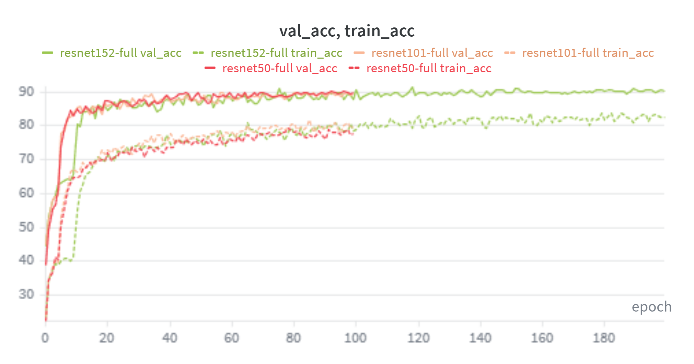
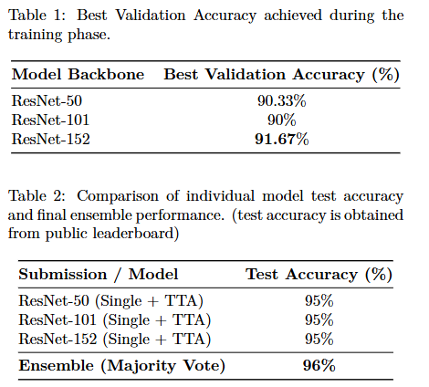

#VRDL HW1

## Introduction

The gaol of this homework is a image classification task with 100 classes. 

The core idea of this project is to leverage Transfer Learning with an Ensemble of ResNet Backbones (ResNet-50, ResNet-101, and ResNet-152) pre-trained on ImageNet-1K (V2 weights).

To achieve high generalization performance (96% test accuracy) on a relatively small dataset, we implemented a robust training recipe:

1. Data Augmentation: RandAugment, Mixup, and CutMix to prevent overfitting.

2. Regularization: Label Smoothing, weight decay, and Dropout

3. Inference Strategy: 7-view Test-Time Augmentation (TTA) and Majority Voting.

4. Optimization: AdamW optimizer with Cosine Annealing and a Warmup phase.

## Environment setup

It is recommended to use Conda to manage the environment. You can recreate the environment used for this project using either the environment.yml or requirements.txt provided.

``` bash
# Using environment.yml
conda env create -f environment.yml

# Activate the environment
conda activate VRDL_1
```

## Usage

```bash
git clone https://github.com/Yu-Hsuan-1220/NYCU_Visual_Recognition_Using_Deep_Learning.git

# Put the dataset in dataset folder, and the structure should be like:
HW1/
├── dataset/
│   ├── data/
│   │   ├── train/
│   │   │   ├── 0/
│   │   │   ├── 1/
│   │   │   ├── ...
│   │   ├── val/
│   │   │   ├── 0/
│   │   │   ├── 1/
│   │   │   ├── ...
│   │   ├── test/
│   │   │   ├── ...


cd NYCU_Visual_Recognition_Using_Deep_Learning/HW1/src
# Train the models
python train.py --backbone resnet50 --img_size 224 --batch_size 64 --epochs 100 \
--lr 1e-3 --lr_backbone 1e-4 --weight_decay 5e-4 --optimizer adamw --scheduler cosine --warmup_epochs 5 \
--use_RandAugment --use_mixup_and_cutmix --use_label_smoothing --label_smoothing 0.1 --dropout 0.5 \
--wandb_run_name resnet50-full

python train.py --backbone resnet101 --img_size 224 --batch_size 64 --epochs 100 \
--lr 1e-3 --lr_backbone 1e-4 --weight_decay 5e-4 --optimizer adamw --scheduler cosine --warmup_epochs 5 \
--use_RandAugment --use_mixup_and_cutmix --use_label_smoothing --label_smoothing 0.1 --dropout 0.5 --save_dir checkpoints_1\
--wandb_run_name resnet101-full

python train.py --backbone resnet152 --img_size 224 --batch_size 64 --epochs 200 \
--lr 1e-3 --lr_backbone 1e-4 --weight_decay 5e-4 --optimizer adamw --scheduler cosine --warmup_epochs 10 --save_dir checkpoints_2\
--use_RandAugment --use_mixup_and_cutmix --use_label_smoothing --label_smoothing 0.1 --dropout 0.5 \
--wandb_run_name resnet152-full

# Inference with TTA

python inference.py --backbone resnet50 --dropout 0.5 \
--checkpoint ./checkpoints/best_resnet50.pth --output_csv prediction1.csv --use_tta

python inference.py --backbone resnet101 --dropout 0.5 \
--checkpoint ./checkpoints_1/best_resnet101.pth --output_csv prediction2.csv --use_tta

python inference.py --backbone resnet152 --dropout 0.5 \
--checkpoint ./checkpoints_2/best_resnet152.pth --output_csv prediction3.csv --use_tta

# Voting ensemble

python voting.py --input_csvs prediction3.csv prediction2.csv prediction1.csv

```

## Performance Snapshot

### Training accuracy and validation accuracy curve



### Validation accuracy and test accuracy of each backbone


