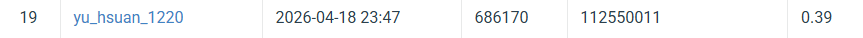
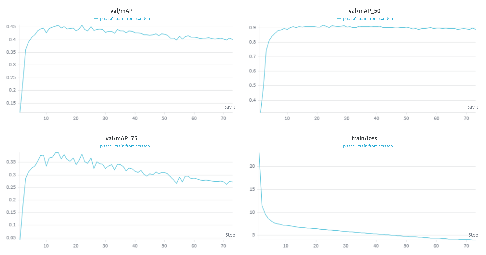
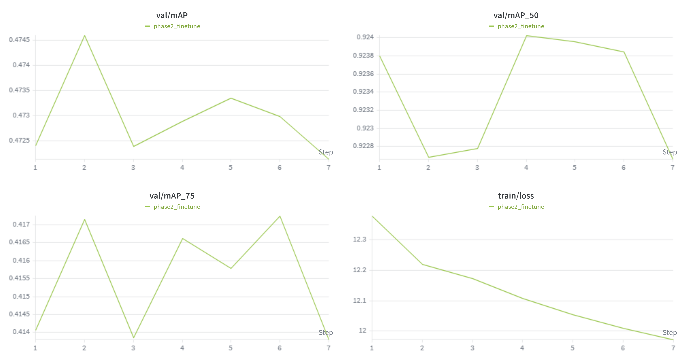

# VRDL HW2

- Student ID: 112550011 
- Name: 李佑軒

## Introduction 

The objective of this Lab is to develop a robust digit detection system capable of identifying and localizing numbers (0-9) in various image environments using DETR with ResNet50 backbone. The primary metric for success is the $mAP@[.5:.95]$, which requires the model to not only find the digits (Recall) but also to provide highly accurate bounding box predictions (Precision).

## Environment setup

It is recommended to use Conda to manage the environment. You can recreate the environment used for this project using either the environment.yml or requirements.txt provided.

``` bash
# Using environment.yml
cd HW2
conda env create -f environment.yml

# Activate the environment
conda activate VRDL_2
```

## Usage

```bash
git clone https://github.com/Yu-Hsuan-1220/NYCU_Visual_Recognition_Using_Deep_Learning.git
```

Prepare the dataset download from [Google Drive](https://drive.google.com/file/d/13JXJ_hIdcloC63sS-vF3wFQLsUP1sMz5/view)

The dataset should be organized as follows:
```bash
HW2/
├── dataset/
│   ├── test/
│   │   ├── 1.png
│   │   ├── 2.png
│   │   ├── ...
│   ├── train/
│   │   ├── 1.png
│   │   ├── 2.png
│   │   ├── ...
│   ├── valid/
│   │   ├── 1.png
│   │   ├── 2.png
│   │   ├── ...
│   ├── train.json
│   ├── valid.json

```

### Training

```bash
cd NYCU_Visual_Recognition_Using_Deep_Learning/HW2/src

python train.py \
--aux_loss \
--output_dir ./output_phase1 \
--wandb \
--amp \
--with_box_refine \
--freeze_at 0 \
--num_feature_levels 3 \
--lr 1e-4 \
--lr_backbone 1e-5 \
--aug_iso_noise \
--aug_translation \
--aug_expand

# Stop phase1 training when reaching 14 epochs, then start phase2 training with the following command:

python train.py \
--aux_loss \
--output_dir ./output_phase2 \
--wandb \
--amp \
--with_box_refine \
--freeze_at 2 \
--num_feature_levels 3 \
--lr 5e-6 \
--lr_backbone 5e-7 \
--warmup_epochs 0 \
--load_weights ./output_phase1/best.pth \
--cost_bbox 8.0 \
--cost_giou 5.0 \
--loss_bbox_coef 8.0 \
--loss_giou_coef 5.0 \
--weight_decay 1e-3

```

### Inference

```bash
python inference.py \
--checkpoint ./output_phase2/best.pth \
--score_threshold 0.01 
```

## Performance snapshot

### screenshot of the leaderboard



### Training loss and validation accuracy curve for two phases




