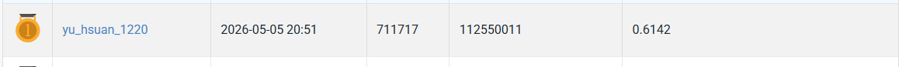
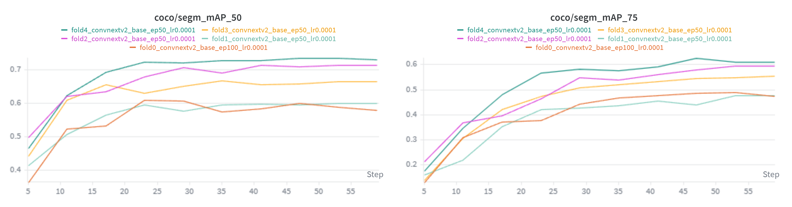

# VRDL HW3

- Student ID: 112550011 
- Name: 李佑軒

## Introduction

This assignment tackles **instance segmentation** on a medical cell microscopy dataset containing four cell categories. Each training sample includes a raw `.tif` image paired with per-class instance mask files (`class1.tif`–`class4.tif`), where pixel values encode individual cell instances.

The solution is built on **Cascade Mask R-CNN** with a **ConvNeXt-V2-Base** backbone and **FPN** neck, implemented via MMDetection. To maximize generalization on the small dataset, a **5-fold stratified cross-validation** strategy is adopted. During inference, **Test-Time Augmentation (TTA)** (original, horizontal flip, vertical flip) is applied per model, and predictions from all five fold checkpoints are merged using **Weighted Box Fusion (WBF)** with score-weighted mask averaging. The evaluation metric is COCO-style **segm mAP@0.5**.

## Environment setup

## Usage

```bash
git clone https://github.com/Yu-Hsuan-1220/NYCU_Visual_Recognition_Using_Deep_Learning.git
```
Prepare the dataset download from [Google Drive](https://drive.google.com/file/d/1uCnJ3LrsBHOeQoJDoe4Yg8H32VuQJodv/view)

The dataset should be organized as follows:
```bash
HW3/
├── dataset/
│   ├── test_release/
│   │   ├── 0bd26f8e-81f6-4267-82ad-740e2786393a.tif
│   │   ├── 0fb9d9c0-f786-49c5-b485-b8dfdcce929c.tif
│   │   ├── ...
│   ├── train/
│   │   ├── 0aaa252e-b503-4503-bdc6-387a5cfe2622/
│   │   ├── 0bacdb96-9964-4920-a645-683683d4559c/
│   │   ├── ...
│   ├── test_image_name_to_ids.json
```

### Training

```bash
cd NYCU_Visual_Recognition_Using_Deep_Learning/HW3/src


python prepare_coco_dataset.py

python train.py --fold 0 --epochs 100 --amp
python train.py --fold 1 --epochs 50 --amp
python train.py --fold 2 --epochs 50 --amp
python train.py --fold 3 --epochs 50 --amp
python train.py --fold 4 --epochs 50 --amp

```

### Inference

```bash
python inference.py \
  --checkpoints ../work_dirs/fold0/best_coco_segm_mAP_50_epoch_20.pth \
                ../work_dirs/fold1/best_coco_segm_mAP_50_epoch_45.pth \
                ../work_dirs/fold2/best_coco_segm_mAP_50_epoch_45.pth \
                ../work_dirs/fold3/best_coco_segm_mAP_50_epoch_30.pth \
                ../work_dirs/fold4/best_coco_segm_mAP_50_epoch_40.pth \
  --output ../test-results-ensemble.json --tta --load_all_models --tta_rotation
```

## Performance snapshot

### Screenshot of the leaderboard



### Validation curve across 5 folds

