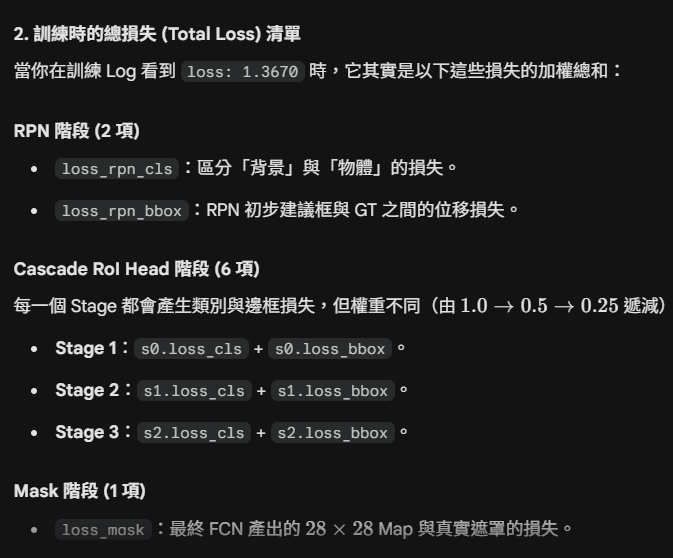

# HW3 Instance Segmentation — 完整技術報告

> **模型**：Cascade Mask R-CNN + ConvNeXt-V2-Base + FPN  
> **框架**：MMDetection 3.x / MMEngine  
> **最佳策略**：5-Fold Cross Validation × TTA × WBF Ensemble  
> **執行腳本**：`run.sh`

---

## 目錄

1. [整體流程概覽](#1-整體流程概覽)
2. [資料前處理](#2-資料前處理)
3. [訓練資料增強 (Augmentation)](#3-訓練資料增強-augmentation)
4. [模型架構](#4-模型架構)
   - 4.1 [ConvNeXt-V2-Base Backbone](#41-convnext-v2-base-backbone)
   - 4.2 [FPN Neck](#42-fpn-neck)
   - 4.3 [Region Proposal Network (RPN)](#43-region-proposal-network-rpn)
   - 4.4 [Cascade RoI Head（3-stage Bbox）](#44-cascade-roi-head3-stage-bbox)
   - 4.5 [FCN Mask Head](#45-fcn-mask-head)
5. [訓練流程](#5-訓練流程)
6. [Inference 流程](#6-inference-流程)
   - 6.1 [單模型推論](#61-單模型推論)
   - 6.2 [Test-Time Augmentation (TTA)](#62-test-time-augmentation-tta)
   - 6.3 [5-Fold WBF Ensemble](#63-5-fold-wbf-ensemble)
7. [超參數總覽](#7-超參數總覽)

---

## 1. 整體流程概覽

```
原始資料 (.tif)
      │
      ▼
prepare_coco_dataset.py
  ├── 讀取 image.tif + class*.tif mask
  ├── instance mask → polygon / RLE
  ├── StratifiedKFold(n=5, seed=42) 切分
  └── 輸出 fold{0-4}_train.json / fold{0-4}_val.json
      │
      ▼ (×5 fold)
train.py
  ├── LoadTifImageFromFile → RandomResize → RandomCrop → RandomFlip (H+V)
  ├── ConvNeXt-V2-Base (4-stage backbone, ImageNet pretrained)
  ├── FPN (5-level, 256ch)
  ├── RPN → 候選框
  ├── Cascade RoI Head (stage1/2/3: IoU 0.5/0.6/0.7)
  ├── FCN Mask Head (4-conv, 28×28 output)
  └── 儲存最佳 segm_mAP_50 checkpoint
      │
      ▼
inference.py --tta --load_all_models (5 checkpoints)
  ├── 對每張 test 圖，每個 model 做 TTA (3 views)
  ├── Per-model class-wise NMS 合併 TTA 預測
  ├── WBF: 5-fold 預測做 bbox IoU 聚類 + mask 加權平均
  └── 輸出 test-results-ensemble.json (COCO RLE 格式)
```

---

## 2. 資料前處理

### 2.1 輸入格式

資料集為醫學細胞影像：
- `train/{id}/image.tif`：原始影像（可能為 RGB、RGBA 或 Grayscale）
- `train/{id}/class{1-4}.tif`：各類別的 instance mask（像素值 = instance id，0 為背景）
- 測試集僅有 `test_release/*.tif`

### 2.2 影像讀取與通道處理（`LoadTifImageFromFile`）

```
tifffile.imread(path)
  ├── RGBA → 丟棄 alpha channel → RGB [H, W, 3]
  ├── Grayscale → 複製 3 份 → [H, W, 3]
  └── RGB → [::-1] → BGR（MMDetection/OpenCV 格式）
  → np.ascontiguousarray(uint8)   ← 必要：[::-1] 產生 negative stride，
                                     不轉 contiguous 會讓 tensor 轉換錯誤
```

### 2.3 Annotation 轉換（`prepare_coco_dataset.py`）

```
class{c}.tif mask
  → np.unique() 取得所有 instance id（跳過 0）
  → 每個 instance binary_mask = (mask == inst_id)
  → area < 10 → 跳過（濾掉雜訊小區域）
  → cv2.findContours → polygon segmentation
     （若 contour 點數不足 3 → fallback RLE）
  → COCO annotation dict：
      { id, image_id, category_id,
        segmentation, area,
        bbox: [x, y, w, h],   ← COCO 格式：左上角 + 寬高
        iscrowd: 0 }
```

### 2.4 5-Fold Stratified Split

```python
StratifiedKFold(n_splits=5, shuffle=True, random_state=42)
    stratify by: 每張圖的 class 數量（= class_counts）
```

- 用 **class 數量**作為 stratify key，確保每個 fold 的 class 分布均勻
- 各 fold 約 80% train / 20% val

---

## 3. 訓練資料增強 (Augmentation)

訓練 pipeline 依序執行以下操作（`get_train_pipeline`）：

```
原圖 (任意尺寸)
      │
      ▼  1. LoadTifImageFromFile
         → BGR uint8 numpy array

      │
      ▼  2. LoadAnnotations(with_bbox=True, with_mask=True)
         → 載入 polygon/RLE mask → 轉為 BitmapMask

      │
      ▼  3. RandomResize
         scale=(1024, 1024), ratio_range=(0.5, 2.0), keep_ratio=True
         → 隨機縮放到原圖的 50%～200%
         → 長邊不超過 2048px

      │
      ▼  4. RandomCrop
         crop_size=(1024, 1024), crop_type="absolute"
         recompute_bbox=True, allow_negative_crop=True
         → 從縮放後的圖隨機裁 1024×1024 窗口
         → bbox/mask 同步裁切

      │
      ▼  5. RandomFlip(prob=0.5, direction="horizontal")
         → 50% 機率水平翻轉，bbox & mask 同步翻

      │
      ▼  6. RandomFlip(prob=0.5, direction="vertical")
         → 50% 機率垂直翻轉，bbox & mask 同步翻

      │
      ▼  7. FilterAnnotations(min_gt_bbox_wh=(1, 1))
         → 過濾 RandomCrop 後寬或高為 0 的 bbox
         → 防止 DeltaXYWH encode 出現 log(0) = -inf → NaN loss

      │
      ▼  8. Pad(size=(1024, 1024), pad_val=(114, 114, 114))
         → 填充到 1024×1024（灰色填充值 114 為 ImageNet 常用值）

      │
      ▼  9. PackDetInputs
         → 打包成 MMDetection DataSample 格式
```

### Augmentation 設計說明

| 操作 | 目的 |
|------|------|
| MultiScale Resize (0.5×–2.0×) | 讓模型學習偵測不同大小的細胞 |
| RandomCrop 1024 | 相當於隨機平移，增加位置多樣性 |
| H-Flip + V-Flip | 細胞形態具有各向同性，4 個方向都合理 |
| Pad to 1024 | 確保 batch 內所有圖同尺寸；pad_val=114 接近 ImageNet mean |
| FilterAnnotations | 防止 RandomCrop 產生退化 GT bbox 導致 NaN loss |

**驗證 / 測試 pipeline**（無隨機操作）：
```
LoadTifImageFromFile → Resize(1024, keep_ratio=True) → Pad(1024) → PackDetInputs
```

---

## 4. 模型架構

整體架構為 **Cascade Mask R-CNN**，由 Backbone → Neck → RPN → RoI Head 串接：

```
Input: (B, 3, 1024, 1024)  BGR, normalized by ImageNet mean/std
                                  ↓
         ┌────────────────────────────────────┐
         │   4.1  ConvNeXt-V2-Base Backbone   │
         └────────────────────────────────────┘
    C0(128ch, s4)  C1(256ch, s8)  C2(512ch, s16)  C3(1024ch, s32)
                                  ↓
         ┌────────────────────────────────────┐
         │        4.2  FPN Neck               │
         └────────────────────────────────────┘
    P2(256ch, s4)  P3(256ch, s8)  P4(256ch, s16)  P5(256ch, s32)  P6(256ch, s64)
                                  ↓
         ┌────────────────────────────────────┐
         │        4.3  RPN Head               │
         └────────────────────────────────────┘
    2000 proposals (training) / 1000 proposals (testing)
                                  ↓
         ┌──────────────────────────────────────────────────┐
         │        4.4  Cascade RoI Head (×3 stages)         │
         │  Stage 1 (IoU≥0.5): RoIAlign 7×7 → FC → cls+reg │
         │  Stage 2 (IoU≥0.6): refine proposals again       │
         │  Stage 3 (IoU≥0.7): final high-quality bbox      │
         └──────────────────────────────────────────────────┘
                                  ↓
         ┌────────────────────────────────────┐
         │        4.5  FCN Mask Head          │
         └────────────────────────────────────┘
    Per-instance binary mask (28×28 → resize to original size)
```

---

### 4.1 ConvNeXt-V2-Base Backbone

ConvNeXt-V2 是 ConvNeXt V1 的進化版，核心改動是以 **GRN（Global Response Normalization）** 取代 V1 的 Layer Scale，大幅強化特徵多樣性。

**架構**（via timm `features_only=True`）：

```
Input: (B, 3, H, W), normalized
    │
    ▼  Stem: 4×4 conv, stride 4, 128ch
    │
    ├── Stage 0: 3× ConvNeXtV2 Block → (B, 128, H/4,  W/4 ) ← C0
    ├── Stage 1: 3× ConvNeXtV2 Block → (B, 256, H/8,  W/8 ) ← C1
    ├── Stage 2: 27× ConvNeXtV2 Block → (B, 512, H/16, W/16) ← C2
    └── Stage 3: 3× ConvNeXtV2 Block → (B, 1024, H/32, W/32) ← C3
```

**ConvNeXtV2 Block**：
```
input
  → depthwise conv 7×7
  → LayerNorm
  → Linear (expand 4×)
  → GELU
  → GRN (Global Response Normalization)   ← V2 新增，防止特徵坍縮
  → Linear (compress 4×)
  → Stochastic Depth (drop_path_rate=0.4)
  → + input (residual)
```

**為何需要額外 LayerNorm**（自定義 `ConvNeXtV2Backbone` 的關鍵）：

GRN 操作可能在某些輸入分布下產生 ±4000 量級的特徵值，直接傳入 FPN 的 1×1 conv 會導致 NaN。因此在每個 stage 輸出後額外加一層 LayerNorm：

```python
feat = feat.permute(0, 2, 3, 1)   # (B,C,H,W) → (B,H,W,C)
feat = self.norms[i](feat)         # LayerNorm over channel dim
feat = feat.permute(0, 3, 1, 2)   # (B,H,W,C) → (B,C,H,W)
```

**輸出通道**：

| Stage | 輸出名 | stride | channels |
|-------|--------|--------|----------|
| 0     | C0     | 4      | 128      |
| 1     | C1     | 8      | 256      |
| 2     | C2     | 16     | 512      |
| 3     | C3     | 32     | 1024     |

---

### 4.2 FPN Neck

Feature Pyramid Network 將 backbone 的多尺度特徵統一投影到同一通道數，再建立自頂向下的特徵融合。

```
C0(128ch) ──1×1 conv──► 256ch
C1(256ch) ──1×1 conv──► 256ch ──┐
C2(512ch) ──1×1 conv──► 256ch ──┤  top-down pathway (upsample + add)
C3(1024ch)──1×1 conv──► 256ch ──┘
                                 ↓
    P2 = C0_proj + upsample(P3)        stride 4,  (B, 256, H/4,  W/4 )
    P3 = C1_proj + upsample(P4)        stride 8,  (B, 256, H/8,  W/8 )
    P4 = C2_proj + upsample(P5)        stride 16, (B, 256, H/16, W/16)
    P5 = C3_proj                       stride 32, (B, 256, H/32, W/32)
    P6 = MaxPool2d(P5)                 stride 64, (B, 256, H/64, W/64)
                                 ↓
    每個 level 再接 3×3 conv (anti-aliasing)
    輸出 5 個 256-ch 特徵圖：[P2, P3, P4, P5, P6]
```

> FPN 讓小物體走 P2/P3（高解析度），大物體走 P5/P6（大感受野），對大小差異懸殊的細胞特別重要。

---

### 4.3 Region Proposal Network (RPN)

RPN 在所有 FPN level 上滑動，為每個位置預測 objectness score 和 bbox offset。

**Anchor 設定**：

| FPN Level | stride | Anchor scale | Anchor ratios | Anchor 大小（像素） |
|-----------|--------|-------------|---------------|---------------------|
| P2        | 4      | 8           | 0.5, 1.0, 2.0 | ~23, ~32, ~45 px   |
| P3        | 8      | 8           | 0.5, 1.0, 2.0 | ~45, ~64, ~91 px   |
| P4        | 16     | 8           | 0.5, 1.0, 2.0 | ~91, ~128, ~181 px |
| P5        | 32     | 8           | 0.5, 1.0, 2.0 | ~181, ~256, ~362 px|
| P6        | 64     | 8           | 0.5, 1.0, 2.0 | ~362, ~512, ~724 px|

**訓練時 target assignment**：
- Positive: IoU ≥ 0.7 → 學習 bbox regression
- Negative: IoU < 0.3 → 學習抑制背景
- 每張圖取 256 個 anchor：50% positive + 50% negative（最多）
- RPN loss = CrossEntropy (cls) + SmoothL1 (bbox reg)

**NMS 後輸出的 Proposals**：

| 階段 | NMS 前保留 | NMS IoU | 最終 proposals |
|------|-----------|---------|---------------|
| Training | 2000 | 0.7 | 2000 |
| Testing | 1000 | 0.7 | 1000 |

---

### 4.4 Cascade RoI Head（3-stage Bbox）

Cascade R-CNN 的核心思想：每一個 stage 都用更嚴格的 IoU threshold 來訓練，前一 stage 的輸出框作為下一 stage 的輸入，逐步精化 bbox 位置和置信度。

```
1000 RPN proposals (xyxy)
      │
      ▼──────────────── Stage 1 (IoU threshold = 0.5) ─────────────────
      │  RoIAlign(7×7, sampling_ratio=0) 從 P2-P5 抽取特徵
      │  → (B×512, 256, 7, 7)
      │  → Flatten → FC(1024) → ReLU → FC(1024) → ReLU
      │  → [cls head: FC(num_classes+1)]   CrossEntropy loss, weight=1.0
      │  → [reg head: FC(4)]               SmoothL1 loss,    weight=1.0
      │  target_stds = [0.1, 0.1, 0.2, 0.2]  (寬鬆的 delta 目標)
      │  → refine bbox → 送入 Stage 2
      │
      ▼──────────────── Stage 2 (IoU threshold = 0.6) ─────────────────
      │  (同 Stage 1 結構，但 target_stds = [0.05, 0.05, 0.1, 0.1])
      │  loss weight = 0.5
      │  → refine bbox → 送入 Stage 3
      │
      ▼──────────────── Stage 3 (IoU threshold = 0.7) ─────────────────
      │  (同結構，target_stds = [0.033, 0.033, 0.067, 0.067])
      │  loss weight = 0.25
      │  → 最終 bbox + class score
      │
      ▼  測試時：
         score_thr=0.05 → 過濾低信心預測
         class-wise NMS(iou_threshold=0.5) → 去重
         max 300 個 detections per image
```

**Cascade 的優勢**：
- Stage 1 (0.5) 確保高 recall（不漏掉真實物件）
- Stage 3 (0.7) 確保高 precision（只保留高 IoU 預測）
- 三個 stage 的分類 score 平均後可信度更高

**Shared2FCBBoxHead 的 class-agnostic regression**：
```python
reg_class_agnostic=True
```
bbox regression head 只輸出 4 個值（不分類別），讓所有類別共享同一個 regression head，對小資料集有正則化效果，避免 per-class regression 過擬合。

---

### 4.5 FCN Mask Head

在最終 Stage 3 的 proposals 上，額外抽取更大的 RoI 來預測 instance mask：

```
Stage 3 refined bbox proposals
      │
      ▼  MaskRoIExtractor
         RoIAlign(output_size=14×14, sampling_ratio=0)
         從 P2-P5 根據 proposal 大小選擇合適的 level
         → (N, 256, 14, 14)
      │
      ▼  FCNMaskHead (4× conv layers)
         Conv(256→256, 3×3) + ReLU   × 4
         → (N, 256, 14, 14)
      │
      ▼  ConvTranspose2d (upsample ×2)
         → (N, 256, 28, 28)
      │
      ▼  Conv(256→num_classes, 1×1)
         → (N, 4, 28, 28)   per-class binary logit map
      │
      ▼  訓練：Binary CrossEntropy (只計算 GT class 那個 channel)
         測試：sigmoid → threshold 0.5 → binary mask
              → bilinear/nearest resize 到原始 bbox 大小
              → 貼回原圖位置 → 輸出 instance mask
```

> 28×28 的 mask 解析度雖然不高，但對細胞這類相對圓潤的形狀已足夠。




---

## 5. 訓練流程

### 5.1 Optimizer：AdamW

```
AdamW(
    lr = 1e-4,          # 全局 base LR
    betas = (0.9, 0.999),
    weight_decay = 0.05,
    # 分層 LR：backbone 使用 0.1× LR
    backbone LR = 1e-5  (backbone_lr_mult=0.1)
)
```

- **backbone 使用更小的 LR**：pretrained backbone 已經學到豐富特徵，用小 LR 微調而不是重新學
- **weight_decay=0.05**：AdamW 的 L2 正則化，針對 Transformer 類架構常見設定
- **norm 層和 bias 不做 weight decay**（`decay_mult=0.0`）：LayerNorm 的 γ/β 和所有 bias 不參與正則化

### 5.2 Learning Rate Schedule

```
Epoch 0-5:  Linear Warmup
            LR: 0.001 × 1e-4 → 1e-4
            (start_factor=0.001，防止訓練初期梯度爆炸)

Epoch 5-50: Cosine Annealing
            LR: 1e-4 → 1e-4 × 0.01 = 1e-6
            (min_lr_ratio=0.01)
```

### 5.3 Gradient Clipping

```
max_norm = 1.0, norm_type = 2  (L2 norm)
```
防止 loss spikes 時梯度爆炸，在使用 AMP 時尤為重要。

### 5.4 Mixed Precision Training (AMP)

```
AmpOptimWrapper (torch.cuda.amp)
    → 前向 / backward 用 FP16 計算（速度快、顯存少）
    → GradScaler 動態調整 loss scale
    → 參數更新用 FP32（數值穩定）
```

> 注意：ConvNeXt-V2 的 GRN 搭配 AMP 有時會產生 NaN，因此額外加了 LayerNorm（見 4.1 章節）來壓縮特徵量級。

### 5.5 訓練配置總結

| 設定 | 值 |
|------|----|
| epochs | 50 |
| batch_size | 2 |
| img_scale | 1024 × 1024 |
| val_interval | 每 5 epochs |
| save_best | coco/segm_mAP_50 |
| max_keep_ckpts | 3 |
| seed | 42 |
| num_workers | 4 |

### 5.6 Cross Validation 策略

```
5-Fold Stratified CV
  ├── fold0: train fold1-4 (80%), val fold0 (20%) → best: epoch 20
  ├── fold1: train fold0,2-4 (80%), val fold1 (20%) → best: epoch 45
  ├── fold2: train fold0-1,3-4 (80%), val fold2 (20%) → best: epoch 45
  ├── fold3: train fold0-2,4 (80%), val fold3 (20%) → best: epoch 30
  └── fold4: train fold0-3 (80%), val fold4 (20%) → best: epoch 40
```

每個 fold 用 validation set 的 `segm_mAP_50` 作為 early stopping 準則，選最佳 epoch。

---

## 6. Inference 流程

### 6.1 單模型推論

```
test_image.tif
      │
      ▼  LoadTifImageFromFile（BGR uint8，見 2.2）
      │
      ▼  Resize(1024, keep_ratio=True)
         → 長邊縮到 1024，短邊等比例縮
      │
      ▼  Pad(1024×1024, pad_val=114)
      │
      ▼  DetDataPreprocessor
         - BGR → RGB (bgr_to_rgb=True)
         - Normalize: mean=[123.675, 116.28, 103.53]
                       std=[58.395, 57.12, 57.375]
         - pad_size_divisor=32（確保尺寸被 32 整除）
      │
      ▼  ConvNeXt-V2-Base + FPN
         → [P2, P3, P4, P5, P6]
      │
      ▼  RPN → top-1000 proposals
      │
      ▼  Cascade RoI Head (3 stages)
         → N detections (bbox_xyxy, class_score)
      │
      ▼  FCN Mask Head
         → N binary masks (28×28 → resize to ori size)
      │
      ▼  Post-processing:
         score_thr=0.05 → 過濾
         class-wise NMS(iou=0.5) → 去重
         max 300 detections
```

---

### 6.2 Test-Time Augmentation (TTA)

對每張測試圖執行 **3 個增強版本**，再合併結果：

```
原圖 (H×W)
  ├── View 1: 原圖                → inference → (bboxes1, scores1, masks1)
  ├── View 2: cv2.flip(img, 1)   → inference → (bboxes2, scores2, masks2)
  │           (水平翻轉)              ↓ 翻轉 bbox 和 mask 回原始座標系
  │             bboxes2[:, 0] = mask_w - bboxes[:, 2]
  │             bboxes2[:, 2] = mask_w - bboxes[:, 0]
  │             masks2 = np.flip(masks, axis=2)
  └── View 3: cv2.flip(img, 0)   → inference → (bboxes3, scores3, masks3)
              (垂直翻轉)              ↓ 翻轉 bbox 和 mask 回原始座標系
                bboxes3[:, 1] = mask_h - bboxes[:, 3]
                bboxes3[:, 3] = mask_h - bboxes[:, 1]
                masks3 = np.flip(masks, axis=1)
        │
        ▼  concatenate: bboxes_all, scores_all, masks_all, labels_all
           (最多 3×300 = 900 個候選)
        │
        ▼  Class-wise NMS (per-class, iou_threshold=0.5)
           對每個類別：
             - 取出該類別的所有候選框
             - torchvision.ops.nms(bboxes, scores, iou_threshold=0.5)
             - 保留不重疊的高分框
        │
        ▼  輸出：該 model 在這張圖的最終預測
           (去重後的 bboxes, labels, scores, masks)
```

**TTA 的邏輯**：模型在不同角度看同一個物件，重疊多的才是真實物件，透過 NMS 讓「多個視角都看到的物件」勝出（它的最高分數在所有視角中最高）。

---

### 6.3 5-Fold WBF Ensemble

收集 5 個 fold model 各自的 TTA 預測，用 **Weighted Box Fusion (WBF) + Mask 加權平均**合併。

#### Step 1：收集各 Fold 預測

```python
# 每個 fold 的模型已在 4.2 節通過 TTA+NMS 輸出
for fold_idx, model in enumerate(5_models):
    bboxes_f, labels_f, scores_f, masks_f = tta_inference(model, img)
    # 將 masks resize 到原圖 (ori_h, ori_w)
    masks_f = cv2.resize(each_mask, (ori_w, ori_h), INTER_NEAREST)
    # 打上 fold 標籤
    model_ids_f = np.full(len(bboxes_f), fold_idx)
```

#### Step 2：Per-Class 貪婪 IoU 聚類

對每個類別（class 0–3）分別處理：

```
將所有 fold 的預測按 score 由高到低排序
      │
      ▼  貪婪聚類（greedy clustering）
         for i in all_detections (sorted by score desc):
           if 已被分配：skip
           seed = detection[i]  ← 開一個新 cluster
           for j in remaining:
             IoU(seed_bbox, bbox_j) ≥ 0.55 → 加入此 cluster
           所有加入的 detection 標記 used=True
```

#### Step 3：Cluster 內合併

對每個 cluster（設有 k 個 detection，來自最多 5 個不同 fold）：

```
各 fold 的 scores: [s_1, s_2, ..., s_k]
各 fold 的 bboxes: [b_1, b_2, ..., b_k]   (xyxy)
各 fold 的 masks:  [m_1, m_2, ..., m_k]   (H×W, float32)

1. 加權平均 bbox:
   merged_bbox = Σ(s_i × b_i) / Σ(s_i)

2. 加權平均 mask:
   avg_mask = Σ(s_i × m_i.float()) / Σ(s_i)    (H×W, 值域 0-1)
   merged_mask = (avg_mask ≥ 0.5).astype(uint8)  ← binarize

3. WBF score（獎勵多 fold 共識）:
   unique_folds = |{fold_id for det in cluster}|
   merged_score = mean(s_i) × unique_folds / 5
```

**WBF Score 設計說明**：

| 情況 | 舉例 | merged_score |
|------|------|-------------|
| 5 個 fold 都看到，平均分 0.8 | 共識最高 | 0.8 × 5/5 = **0.80** |
| 3 個 fold 看到，平均分 0.8 | 部分共識 | 0.8 × 3/5 = **0.48** |
| 1 個 fold 看到，分數 0.8 | 單獨偵測 | 0.8 × 1/5 = **0.16** |

→ 多個 model 共同偵測到的物件獲得分數加成，僅單一 model 的偵測被降分。

#### Step 4：最終輸出

```
保留 merged_score ≥ 0.05 的 detections
→ 對每個 detection 的 merged_mask 做 RLE 編碼（pycocotools）
→ 輸出 COCO 格式結果：
  {
    "image_id": <int>,
    "category_id": <1-4>,
    "segmentation": {"size": [H, W], "counts": "<RLE string>"},
    "score": <float>
  }
```

---

## 7. 超參數總覽

### 7.1 模型超參數

| 超參數 | 值 | 意義 |
|--------|----|------|
| `backbone_name` | `convnextv2_base` | 使用 ConvNeXt-V2 Base 作為特徵提取器 |
| `pretrained` | `True` | 使用 ImageNet 預訓練權重，顯著加速收斂 |
| `drop_path_rate` | `0.4` | Stochastic Depth：訓練時以 40% 機率丟棄 block，正則化效果 |
| `fpn_out_channels` | `256` | FPN 各 level 的輸出通道數，決定 RPN 和 RoI head 的輸入維度 |
| `num_classes` | `4` | 類別數量（class1-4），不含背景 |
| `cascade_iou_thresholds` | `(0.5, 0.6, 0.7)` | 3 個 cascade stage 的正樣本 IoU 閾值，逐步提高要求 |
| `cascade_stage_weights` | `(1.0, 0.5, 0.25)` | 各 stage 的 loss 權重，早期 stage 的 loss 降幅較小 |

### 7.2 RPN 超參數

| 超參數 | 值 | 意義 |
|--------|----|------|
| `anchor_scales` | `[8]` | Anchor 基礎大小，配合 FPN stride 覆蓋多種細胞尺度 |
| `anchor_ratios` | `[0.5, 1.0, 2.0]` | Anchor 長寬比，覆蓋橫向、方形、縱向細胞 |
| `rpn_pos_iou_thr` | `0.7` | 與 GT IoU ≥ 0.7 才算 positive anchor |
| `rpn_neg_iou_thr` | `0.3` | IoU < 0.3 才算 negative anchor |
| `rpn_num_anchors` | `256/img` | 每張圖取 256 個 anchor 訓練 RPN |
| `rpn_nms_iou` | `0.7` | RPN proposals 之間的 NMS 閾值 |
| `rpn_pre_nms` | `2000 / 1000` | NMS 前保留的 top-k proposals（train/test） |
| `rpn_post_nms` | `2000 / 1000` | NMS 後保留的最大 proposals 數 |

### 7.3 RoI Head 超參數

| 超參數 | 值 | 意義 |
|--------|----|------|
| `roi_out_size_bbox` | `7×7` | Bbox RoIAlign 輸出大小，平衡精度與速度 |
| `roi_out_size_mask` | `14×14` | Mask RoIAlign 輸出大小（更大以保留空間細節） |
| `fc_out_channels` | `1024` | Shared 2FC head 的中間層維度 |
| `mask_num_convs` | `4` | FCN Mask Head 的 conv 層數 |
| `mask_size_gt` | `28×28` | 訓練時 GT mask 被 resize 到此大小供 supervision |
| `mask_thr_binary` | `0.5` | 測試時 sigmoid 後的 binarize 閾值 |
| `reg_class_agnostic` | `True` | 所有類別共用一個 bbox regression head（小資料集正則化） |
| `rcnn_pos_samples` | `512, pos_fraction=0.25` | 每張圖取 512 個 RoI，其中最多 128 個 positive |

### 7.4 訓練超參數

| 超參數 | 值 | 意義 |
|--------|----|------|
| `lr` | `1e-4` | Base learning rate（非 backbone） |
| `backbone_lr_mult` | `0.1` | Backbone LR = 1e-5，防止 pretrained 特徵被破壞 |
| `weight_decay` | `0.05` | L2 正則化強度，ConvNeXt 系列的推薦值 |
| `warmup_epochs` | `5` | 線性暖身，從 0.001×lr 升至 lr |
| `min_lr_ratio` | `0.01` | Cosine decay 終點 = 0.01 × lr = 1e-6 |
| `grad_clip` | `1.0` | L2 gradient clip，防止梯度爆炸 |
| `epochs` | `50` | 每個 fold 訓練 50 epochs |
| `batch_size` | `2` | 受 GPU 記憶體限制 |
| `amp` | `True` | FP16 訓練，速度 ~1.5×，顯存 ~0.6× |
| `img_scale` | `1024×1024` | 訓練/推論圖像大小 |
| `filter_empty_gt` | `True` | 過濾沒有 GT 的圖像（不參與訓練） |
| `min_size` | `32` | 過濾邊長 < 32px 的小圖像 |

### 7.5 Augmentation 超參數

| 超參數 | 值 | 意義 |
|--------|----|------|
| `resize_ratio_range` | `(0.5, 2.0)` | Multi-scale：縮放到原圖 50%~200% |
| `crop_size` | `1024×1024` | RandomCrop 的固定輸出大小 |
| `hflip_prob` | `0.5` | 水平翻轉機率 |
| `vflip_prob` | `0.5` | 垂直翻轉機率 |
| `pad_val` | `(114, 114, 114)` | Padding 的填充值（接近 ImageNet mean 的灰色） |
| `min_gt_bbox_wh` | `(1, 1)` | FilterAnnotations：過濾退化 GT bbox |

### 7.6 Inference 超參數

| 超參數 | 值 | 意義 |
|--------|----|------|
| `score_threshold` | `0.05` | 最終輸出的置信度門檻 |
| `per_model_score_threshold` | `0.03` | 每個 model 內部 NMS 前的鬆散門檻（讓更多候選進入 WBF） |
| `nms_threshold` | `0.5` | Per-model class-wise NMS 的 IoU 閾值 |
| `max_det` | `300` | 每張圖最多輸出 300 個 detections |
| `tta` | `True` | 啟用 TTA（3 views：原圖、H-flip、V-flip） |
| `wbf_iou_threshold` | `0.55` | WBF 聚類時的 bbox IoU 閾值 |
| `mask_vote_threshold` | `0.5` | Mask 加權平均後的 binarize 閾值 |
| `n_folds` | `5` | 使用 5 個 fold model 做 ensemble |

---

## 附錄：資料流維度追蹤（以 1024×1024 輸入為例）

```
Input image: (1, 3, 1024, 1024)  float32, normalized

Backbone:
  C0: (1, 128,  256, 256)    stride=4
  C1: (1, 256,  128, 128)    stride=8
  C2: (1, 512,   64,  64)    stride=16
  C3: (1, 1024,  32,  32)    stride=32

FPN:
  P2: (1, 256, 256, 256)     stride=4
  P3: (1, 256, 128, 128)     stride=8
  P4: (1, 256,  64,  64)     stride=16
  P5: (1, 256,  32,  32)     stride=32
  P6: (1, 256,  16,  16)     stride=64

RPN anchors per level (3 ratios):
  P2: 256×256×3 = 196,608
  P3: 128×128×3 =  49,152
  P4:  64×64×3  =  12,288
  P5:  32×32×3  =   3,072
  P6:  16×16×3  =     768
  Total: ~262k anchors → NMS → 1000 proposals

Cascade RoI (per proposal):
  RoIAlign 7×7 → (512, 256, 7, 7)
  → FC(1024) → FC(1024) → cls(5) + reg(4)

Mask RoI (per final detection):
  RoIAlign 14×14 → (N, 256, 14, 14)
  → 4×Conv(256,3×3) → ConvTranspose(2×) → (N, 256, 28, 28)
  → Conv(1×1) → (N, 4, 28, 28)
  → sigmoid → threshold → resize to ori bbox size
```
